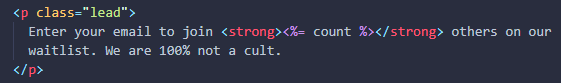

<h1 align="center">
    
</h1>

  <a href="#-instalação-e-execução">Instação e execução</a>&nbsp;&nbsp;&nbsp;|&nbsp;&nbsp;&nbsp;
  <a href="#-projeto">Projeto</a>

 

  

## 🎓 Instalação e execução

1. Faça um clone desse repositório;
2. Importe o banco de dados utilizando os arquivos da pasta `database`

### Console

3. Rode o comando `npm install` para instalar todas as dependências do projeto;
4. Rode `node app.js` para inicializar o site;
5. Entre no link `http://localhost:3000/`.

## 📦 Banco de dados

Atualmente, o projeto possui apenas as funcionalidades de inserção e visualização do total de usuários. 

## 👥 Projeto

O projeto foi feito com base na penúltima seção do curso "The Ultimate MySQL Bootcamp: Go from SQL Beginner to Expert". Seu objetivo é mostrar a possibilidade de conexão entre o MySQL e outras linguagens, no caso, NodeJS.

---

*A imagem de fundo pertence ao tutor [Colt Steele](https://github.com/Colt) | Feito com ♥ by Sofia Rodrigues Ferreira :wave: [Contato](https://www.linkedin.com/in/sofiarodfer/)
